## Incident Name

**Azuki Import/Export – Credential-Based Intrusion & Data Exfiltration**

## Organization

**Azuki Import/Export Trading Co. (梓貿易株式会社)**

---

## REPORT METADATA

| Field          | Value                                      |
| -------------- | ------------------------------------------ |
| Date of Report | 2025-11-26                                 |
| Incident ID    | AZUKI-TH-2025-001                          |
| Severity Level | 🔴 Critical                                |
| Report Status  | ☑ Eradicated                               |
| Escalated To   | Security Operations / Executive Leadership |
| Analyst        | Junaid Asghar                              |
| Data Sources   | Microsoft Defender for Endpoint (MDE)      |

---

## EXECUTIVE SUMMARY

Azuki Import/Export experienced a credential-based intrusion that resulted in unauthorized access to an IT administrator workstation and subsequent theft of sensitive business data. An external attacker successfully authenticated via Remote Desktop Protocol using compromised credentials, performed internal reconnaissance, established multiple persistence mechanisms, harvested credentials from memory, staged proprietary business data, and exfiltrated it using a legitimate cloud service.

The attacker leveraged built-in Windows tools and living-off-the-land binaries (LOLbins) to evade detection, including PowerShell, certutil, schtasks, and native RDP utilities. Persistent access was maintained through a scheduled task and the creation of a backdoor local administrator account. Evidence indicates deliberate targeting of pricing and supplier data, directly correlating with the organization’s competitive disadvantage following the incident.

This activity represents a confirmed malicious intrusion with material business impact.

---

## SUMMARY OF KEY FINDINGS

* Initial access achieved via RDP using valid but compromised credentials
* Defender protections weakened through registry-based exclusion abuse
* Malware staged in a hidden ProgramData directory
* Credential dumping performed using a renamed Mimikatz binary
* Data compressed and exfiltrated to an external cloud service
* Persistent access maintained via scheduled task and local admin account

---

## INCIDENT DETAILS (WHO / WHAT / WHEN / WHERE / WHY / HOW)

### WHO

**Threat Actor**

* Unknown external actor
* Tradecraft consistent with commodity credential-theft and post-exploitation tooling

**Compromised Accounts**

* `kenji.sato` (initial access)
* `support` (backdoor local administrator)

---

### WHAT

The attacker performed the following actions:

1. Gained initial access using stolen credentials over RDP
2. Conducted network discovery to identify internal targets
3. Weakened endpoint defenses via Defender exclusions
4. Downloaded and staged malware using LOLbins
5. Established persistence using a scheduled task and local admin account
6. Dumped credentials from LSASS memory
7. Staged and compressed sensitive business data
8. Exfiltrated data using a cloud-based service
9. Attempted to remove forensic evidence by clearing event logs

---

### WHEN (UTC)

| Time             | Event                                                                             |
| ---------------- | --------------------------------------------------------------------------------- |
| 2025-11-19 18:36 | External attacker authenticated to AZUKI-SL via RDP using compromised credentials |
| 2025-11-19 18:38 | Network reconnaissance performed to enumerate internal hosts                      |
| 2025-11-19 18:40 | Windows Defender exclusions added (extensions and paths)                          |
| 2025-11-19 18:42 | Malware downloaded and staged in `C:\ProgramData\WindowsCache`                    |
| 2025-11-19 18:45 | Scheduled task created to establish persistence                                   |
| 2025-11-19 19:05 | Credential dumping executed against LSASS memory                                  |
| 2025-11-19 19:08 | Backdoor local administrator account created                                      |
| 2025-11-19 19:10 | Sensitive data compressed into archive for exfiltration                           |
| 2025-11-19 19:12 | Data exfiltrated via cloud-based HTTPS channel                                    |
| 2025-11-19 19:20 | Lateral movement initiated to secondary internal system                           |
| 2025-11-19 19:25 | Event logs cleared to impede forensic investigation                               |

---


### WHERE

**Primary Affected Host**

* AZUKI-SL (IT administrator workstation)

**Directories / Locations**

* `C:\ProgramData\WindowsCache`
* `C:\Users\KENJI~1.SAT\AppData\Local\Temp`

**Network / External Services**

* External IP: `88.97.178.12` (initial access)
* C2 / attacker infrastructure: `78.141.196.6`
* Cloud service used for exfiltration: Discord

---

### WHY

**Root Cause**

* Credential compromise and reuse
* Lack of MFA on privileged access
* Insufficient monitoring of administrative RDP usage

**Attacker Objectives**

* Theft of pricing and supplier contract data
* Persistent access for continued exploitation
* Competitive and financial impact

---

### HOW (ATTACK CHAIN OVERVIEW)

1. Initial Access (RDP with stolen credentials)
2. Execution (PowerShell and certutil abuse)
3. Persistence (Scheduled task + admin account)
4. Discovery (Network enumeration)
5. Credential Access (LSASS memory dumping)
6. Collection (Local data staging and compression)
7. Exfiltration (Cloud-based HTTPS channel)

---

## IMPACT ASSESSMENT

**Actual / Potential Impact**

* Exposure of supplier contracts and pricing data
* Loss of competitive advantage
* Reputational and financial risk

**Risk Level**
🔴 Critical

---

## INDICATORS OF COMPROMISE (IOCs)

### Files

| Type    | Indicator                         |
| ------- | --------------------------------- |
| Malware | `mm.exe`                          |
| Malware | `svchost.exe` (non-standard path) |
| Script  | `wupdate.ps1`                     |
| Archive | `export-data.zip`                 |

### Accounts

* `kenji.sato`
* `support`

### Network

* `88.97.178.12`
* `78.141.196.6`

---

## MITRE ATT&CK MAPPING

| Tactic            | Technique             | ID        | Evidence                   |
| ----------------- | --------------------- | --------- | -------------------------- |
| Initial Access    | Remote Services (RDP) | T1021.001 | External RDP login         |
| Execution         | PowerShell            | T1059.001 | Malicious script execution |
| Defense Evasion   | Modify Defender       | T1562.001 | Exclusion registry keys    |
| Persistence       | Scheduled Task        | T1053.005 | schtasks.exe               |
| Credential Access | LSASS Dumping         | T1003.001 | sekurlsa::logonpasswords   |
| Collection        | Archive via Utility   | T1560.001 | ZIP staging                |
| Exfiltration      | Web Service           | T1567.002 | Discord HTTPS upload       |
| Lateral Movement  | RDP                   | T1021.001 | mstsc.exe                  |


## ATTACK CHAIN & FLAG BREAKDOWN

> Each flag represents **one investigation pivot or detection point**.

## 🚩 FLAG 1 — Initial Access: Remote Access Source

**Attack Phase:** Initial Access (TA0001)
**MITRE Technique:** Remote Services: Remote Desktop Protocol (T1021.001)

**Finding:**
An external IP address (**88.97.178.12**) successfully authenticated to the system via RDP, representing the attacker’s initial access into the environment.

**Why it matters:**
Identifying the true external source of initial access enables blocking, attribution, and confirms how the compromise began.

```kql
DeviceLogonEvents
| where DeviceName == "azuki-sl"
| where TimeGenerated between (datetime(2025-11-19) .. datetime(2025-11-20))
| where ActionType == "LogonSuccess"
| where AccountName == "kenji.sato"
| project TimeGenerated, AccountName, LogonType, Protocol, RemoteIP
| order by TimeGenerated asc
```

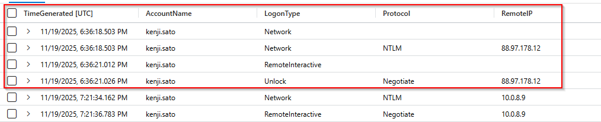

## 🚩 FLAG 2 — Initial Access: Compromised User Account

**Attack Phase:** Initial Access (TA0001)
**MITRE Technique:** Valid Accounts (T1078)

**Finding:**
The user account **kenji.sato** (*Refer to query from flag1*) was used in the successful authentication event associated with the initial unauthorized RDP access.

**Why it matters:**
Identifying the compromised account defines the scope of credential exposure and drives immediate remediation actions such as password resets, account review, and privilege assessment.

## 🚩 FLAG 3 — Discovery: Network Reconnaissance

**Attack Phase:** Discovery (TA0007)
**MITRE Technique:** System Network Configuration Discovery (T1016)

**Finding:**
The attacker executed the command **`arp -a`** to enumerate network neighbors and identify other devices on the local network.

**Why it matters:**
Enumerating network neighbors helps attackers understand network topology and identify potential lateral movement targets.

```kql
DeviceProcessEvents
| where DeviceName == "azuki-sl"
| where TimeGenerated between (datetime(2025-11-19) .. datetime(2025-11-20))
| where AccountName == "kenji.sato"
| where ProcessCommandLine has_any ("arp", "ipconfig", "nbtstat", "route")
| project TimeGenerated, FileName, ProcessCommandLine, ProcessRemoteSessionIP
| order by TimeGenerated asc
```

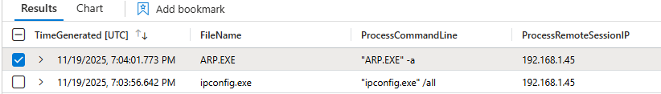

## 🚩 FLAG 4 — Defence Evasion: Malware Staging Directory

**Attack Phase:** Defense Evasion (TA0005)
**MITRE Technique:** Data Staged: Local Data Staging (T1074.001)

**Finding:**
The attacker created and hid the directory **`C:\ProgramData\WindowsCache`**, which was used as the primary staging location for malicious tools and artifacts.

**Why it matters:**
Hidden staging directories allow attackers to store malware and collected data while evading casual detection and security tooling.

```kql
DeviceProcessEvents
| where DeviceName == "azuki-sl"
| where TimeGenerated between (datetime(2025-11-19) .. datetime(2025-11-20))
| where AccountName == "kenji.sato"
| where ProcessCommandLine has_any ("mkdir", "New-Item", "attrib")
| project TimeGenerated, FileName, ProcessCommandLine
| order by TimeGenerated asc
```

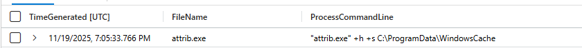

## 🚩 FLAG 5 — Defence Evasion: File Extension Exclusions

**Attack Phase:** Defense Evasion (TA0005)
**MITRE Technique:** Impair Defenses: Disable or Modify Tools (T1562.001)

**Finding:**
The attacker added **3 file extensions** (`.bat`, `.ps1`, `.exe`) to Windows Defender exclusion settings to bypass malware scanning.

**Why it matters:**
Excluding executable and script file types allows malicious tools to run undetected, significantly weakening endpoint protection.

```kql
DeviceRegistryEvents
| where DeviceName == "azuki-sl"
| where TimeGenerated between (datetime(2025-11-19) .. datetime(2025-11-20))
| where RegistryKey has @"Windows Defender\Exclusions\Extensions"
| project TimeGenerated, RegistryValueName
```

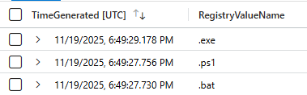

## 🚩 FLAG 6 — Defence Evasion: Temporary Folder Exclusion

**Attack Phase:** Defense Evasion (TA0005)
**MITRE Technique:** Impair Defenses: Disable or Modify Tools (T1562.001)

**Finding:**
The attacker added the folder path **`C:\Users\KENJI~1.SAT\AppData\Local\Temp`** to Windows Defender’s exclusion list, preventing security scanning of files stored in this directory.

**Why it matters:**
Excluding a temporary directory allows attackers to download, execute, and stage malicious tools without detection, significantly reducing the effectiveness of endpoint protection.

```kql
DeviceRegistryEvents
| where DeviceName == "azuki-sl"
| where TimeGenerated between (datetime(2025-11-19) .. datetime(2025-11-20))
| where RegistryKey has @"Windows Defender\Exclusions\Paths"
| project TimeGenerated, RegistryValueName
```

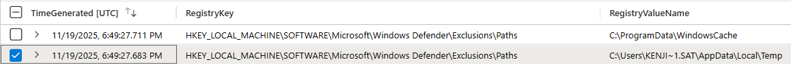

## 🚩 FLAG 7 — Defence Evasion: Download Utility Abuse

**Attack Phase:** Defense Evasion (TA0005)
**MITRE Technique:** Living Off the Land Binaries (T1218)

**Finding:**
The attacker abused the Windows-native binary **`certutil.exe`** to download malicious executables and scripts from an external server.

**Why it matters:**
`certutil.exe` is a trusted Windows utility, and abusing it for file downloads allows attackers to bypass security controls and blend in with legitimate administrative activity.

```kql
DeviceProcessEvents
| where DeviceName == "azuki-sl"
| where TimeGenerated between (datetime(2025-11-19) .. datetime(2025-11-20))
| where ProcessCommandLine has_any ("http", "Invoke-WebRequest")
| project TimeGenerated, FileName, ProcessCommandLine
```

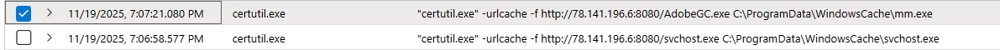

## 🚩 FLAG 8 — Persistence: Scheduled Task Name

**Attack Phase:** Persistence (TA0003)
**MITRE Technique:** Scheduled Task/Job: Scheduled Task (T1053.005)

**Finding:**
The attacker created a scheduled task named **`Windows Update Check`** to maintain persistent execution on the compromised system.

**Why it matters:**
Malicious scheduled tasks allow attackers to re-execute payloads automatically, surviving reboots while blending in with legitimate system maintenance activity.

```kql
DeviceProcessEvents
| where DeviceName == "azuki-sl"
| where TimeGenerated between (datetime(2025-11-19) .. datetime(2025-11-20))
| where FileName == "schtasks.exe"
| where ProcessCommandLine has "/create"
| project TimeGenerated, FileName, ProcessCommandLine
| order by TimeGenerated asc
```

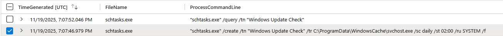

## 🚩 FLAG 9 — Persistence: Scheduled Task Target

**Attack Phase:** Persistence (TA0003)
**MITRE Technique:** Scheduled Task/Job: Scheduled Task (T1053.005)

**Finding:**
The scheduled task was configured to execute **`C:\ProgramData\WindowsCache\svchost.exe`** as its payload.

**Why it matters:**
Pointing a scheduled task to a malicious executable in a hidden staging directory ensures reliable persistence while masquerading as a legitimate Windows process.

## 🚩 FLAG 10 — Command & Control: C2 Server Address

**Attack Phase:** Command and Control (TA0011)
**MITRE Technique:** Application Layer Protocol (T1071)

**Finding:**
The compromised system established outbound communication with the external IP address 78.141.196.6, identified as the attacker’s command-and-control server.

**Why it matters:**
Identifying the C2 server enables network blocking, threat intelligence enrichment, and detection of additional compromised hosts communicating with the same infrastructure.

**Explanation:**

The IP address **78.141.196.6** was identified as the command-and-control (C2) server through correlation of multiple stages of the attack. This IP was initially observed hosting malicious payloads downloaded via **certutil.exe** and PowerShell **Invoke-WebRequest**. After persistence was established using a scheduled task, the malicious executable (**svchost.exe**) located in the staging directory continued to initiate outbound network connections to the same IP address. The repeated communication with this external host across payload delivery, execution, and post-persistence activity confirms that **78.141.196.6** functioned as the attacker’s C2 infrastructure rather than a one-time download source.

## 🚩 FLAG 11 — Command & Control: C2 Communication Port

**Attack Phase:** Command and Control (TA0011)
**MITRE Technique:** Application Layer Protocol (T1071)

**Finding:**
The malicious persistent process (`svchost.exe` located in `C:\ProgramData\WindowsCache`) communicated with the attacker’s command-and-control infrastructure over destination port **443**.

**Why it matters:**
Port **443** enables C2 traffic to blend into normal HTTPS activity, allowing attackers to maintain persistent control while evading basic network filtering that focuses on non-standard ports.

```kql
DeviceNetworkEvents
| where DeviceName == "azuki-sl"
| where TimeGenerated between (datetime(2025-11-19) .. datetime(2025-11-20))
| where RemoteIP == "78.141.196.6"
| project TimeGenerated, RemoteIP, RemotePort, InitiatingProcessFileName, InitiatingProcessCommandLine
```

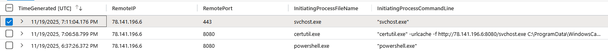

**Explaintion** 
Although port 8080 was used earlier in the attack for payload and script downloads via certutil.exe and PowerShell, the persistent malicious process (svchost.exe located in C:\ProgramData\WindowsCache) later established outbound communication with the attacker infrastructure over port 443. Because port 443 was used for post-persistence, ongoing communication, it represents the true command-and-control (C2) channel rather than the initial delivery mechanism.


## 🚩 FLAG 12 — Credential Access: Credential Theft Tool

**Attack Phase:** Credential Access (TA0006)
**MITRE Technique:** OS Credential Dumping: LSASS Memory (T1003.001)

**Finding:**
The attacker executed the credential dumping tool **`mm.exe`**, which was used to extract credentials from system memory.

**Why it matters:**
Credential dumping allows attackers to harvest plaintext passwords and hashes, enabling privilege escalation, lateral movement, and long-term compromise.

```kql
DeviceProcessEvents
| where DeviceName == "azuki-sl"
| where TimeGenerated between (
    datetime(2025-11-19 19:05:33.766)
    ..
    datetime(2025-11-19 19:09:21.326)
)
| project TimeGenerated, FileName, ProcessCommandLine, AccountName
| order by TimeGenerated asc
```
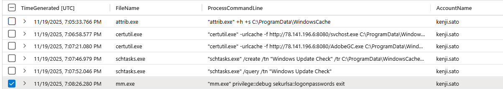

**Explanation (Credential Theft Command):**
The command `mm.exe privilege::debug sekurlsa::logonpasswords exit` indicates execution of a renamed **Mimikatz** credential dumping tool. The `privilege::debug` argument enables access to protected system memory, while `sekurlsa::logonpasswords` extracts plaintext credentials, hashes, and authentication material from the LSASS process. This confirms active credential theft on the compromised system.

## 🚩 FLAG 13 — Credential Access: Memory Extraction Module

**Attack Phase:** Credential Access (TA0006)
**MITRE Technique:** OS Credential Dumping: LSASS Memory (T1003.001)

**Finding:**
The attacker used the **`sekurlsa::logonpasswords`** module to extract credentials from LSASS memory.

**Why it matters:**
This module enables theft of plaintext passwords, hashes, and authentication material, facilitating privilege escalation and lateral movement.

**Query / Screenshot:**
Refer to **FLAG 12**

## 🚩 FLAG 14 — Collection: Data Staging Archive

**Attack Phase:** Collection (TA0009)
**MITRE Technique:** Archive Collected Data: Archive via Utility (T1560.001)

**Finding:**
The attacker created the compressed archive **`export-data.zip`** in the staging directory prior to exfiltration.

**Why it matters:**
Compressing collected data reduces size, simplifies transfer, and is a common precursor to data exfiltration.

```kql
DeviceProcessEvents
| where DeviceName == "azuki-sl"
| where TimeGenerated between (datetime(2025-11-19) .. datetime(2025-11-20))
| where ProcessCommandLine contains "export-data.zip"
| project TimeGenerated, FileName, ProcessCommandLine
```

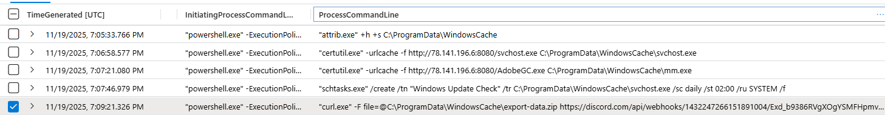

## 🚩 FLAG 15 — Exfiltration: Exfiltration Channel

**Attack Phase:** Exfiltration (TA0010)
**MITRE Technique:** Exfiltration Over Web Service (T1567.002)

**Finding:**
The attacker exfiltrated stolen data using **Discord** via a webhook endpoint.

**Why it matters:**
Abusing legitimate cloud services like Discord allows attackers to blend malicious data exfiltration with normal HTTPS traffic, making detection and blocking more difficult.

## 🚩 FLAG 16 — Anti-Forensics: Log Tampering

**Attack Phase:** Defense Evasion (TA0005)
**MITRE Technique:** Indicator Removal on Host: Clear Windows Event Logs (T1070.001)

**Finding:**
The attacker cleared Windows event logs using `wevtutil.exe`, with the **Security** log being cleared first.

**Why it matters:**
Clearing event logs removes forensic evidence of attacker activity, making incident investigation and timeline reconstruction more difficult.

```kql
DeviceProcessEvents
| where DeviceName == "azuki-sl"
| where TimeGenerated between (datetime(2025-11-19) .. datetime(2025-11-20))
| where ProcessCommandLine has "wevtutil.exe"
| where ProcessCommandLine has " cl "
| project TimeGenerated, FileName, ProcessCommandLine
| order by TimeGenerated asc
```
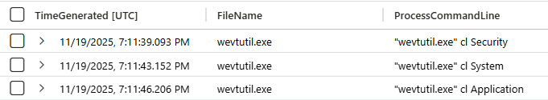

## 🚩 FLAG 17 — Impact: Persistence Account

**Attack Phase:** Impact (TA0040)
**MITRE Technique:** Create Account: Local Account (T1136.001)

**Finding:**
The attacker created a local user account named **`support`** and added it to the **Administrators** group to maintain persistent privileged access.

**Why it matters:**
Creating a hidden or benign-looking administrator account allows attackers to retain long-term access even if malware is removed or credentials are rotated.

```kql
DeviceProcessEvents
| where DeviceName == "azuki-sl"
| where TimeGenerated between (datetime(2025-11-19) .. datetime(2025-11-20))
| where ProcessCommandLine has "/add"
| project TimeGenerated, FileName, ProcessCommandLine
| order by TimeGenerated asc
```
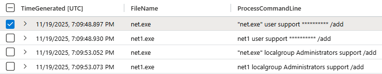

## 🚩 FLAG 18 — Execution: Malicious Script

**Attack Phase:** Execution (TA0002)
**MITRE Technique:** Command and Scripting Interpreter: PowerShell (T1059.001)

**Finding:**
The attacker executed the PowerShell script **`wupdate.ps1`** to automate multiple stages of the attack, including defense evasion, persistence, and credential access.

**Why it matters:**
Malicious scripts enable attackers to chain actions together quickly and reliably, reducing manual interaction and increasing the speed and impact of the compromise.

```kql
DeviceProcessEvents
| where DeviceName == "azuki-sl"
| where TimeGenerated between (datetime(2025-11-19) .. datetime(2025-11-20))
| where FileName == "powershell.exe"
| where ProcessCommandLine contains "wupdate.ps1"
| project TimeGenerated, FileName, ProcessCommandLine
| order by TimeGenerated asc
```

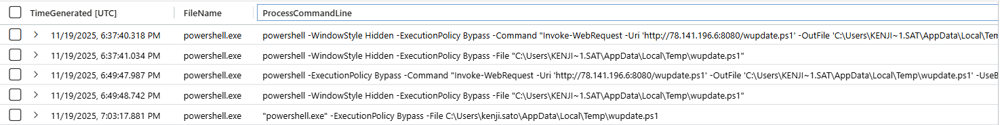

## 🚩 FLAG 19 — Lateral Movement: Secondary Target

**Attack Phase:** Lateral Movement (TA0008)
**MITRE Technique:** Use Alternate Authentication Material (T1550)

**Finding:**
The attacker initiated a Remote Desktop connection to the secondary target system at IP address **10.1.0.188**.

**Why it matters:**
Identifying lateral movement targets reveals attacker objectives and helps determine the scope of compromise across the network.

```kql
DeviceProcessEvents
| where DeviceName == "azuki-sl"
| where TimeGenerated between (datetime(2025-11-19) .. datetime(2025-11-20))
| where ProcessCommandLine has_any ("mstsc", "cmdkey")
| project TimeGenerated, FileName, ProcessCommandLine
| order by TimeGenerated asc
```
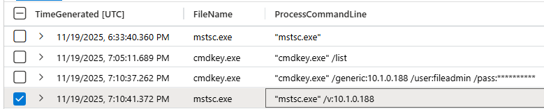

## 🚩 FLAG 20 — Lateral Movement: Remote Access Tool

**Attack Phase:** Lateral Movement (TA0008)
**MITRE Technique:** Remote Services: Remote Desktop Protocol (T1021.001)

**Finding:**
The attacker used **`mstsc.exe`** to establish a Remote Desktop connection to the secondary system during lateral movement.

**Why it matters:**
Abusing built-in remote access tools like `mstsc.exe` allows attackers to move laterally while blending in with legitimate administrative activity, making detection more difficult.

## RECOMMENDATIONS

### IMMEDIATE ACTIONS

* Disable and reset credentials for all compromised accounts (`kenji.sato`, `support`)
* Remove unauthorized local administrator accounts
* Delete malicious scheduled tasks and staged malware files
* Reimage AZUKI-SL to ensure full eradication
* Block attacker IPs and domains at network perimeter

---

### SHORT-TERM (1–7 DAYS)

* Enforce MFA for all privileged and remote access accounts
* Audit RDP usage and restrict access to approved source IP ranges
* Review and remove unauthorized Windows Defender exclusions
* Conduct credential resets for accounts accessed during the incident
* Perform endpoint-wide scans for indicators of compromise

---

### LONG-TERM IMPROVEMENTS

* Implement privileged access management (PAM) for administrative accounts
* Monitor for abuse of LOLBins such as `certutil`, `schtasks`, `cmdkey`, and `mstsc`
* Enable alerting for Defender exclusion changes and scheduled task creation
* Improve credential hygiene and prohibit plaintext credential storage
* Conduct regular threat hunting focused on credential abuse and lateral movement
* Provide security awareness training on phishing and credential protection
---